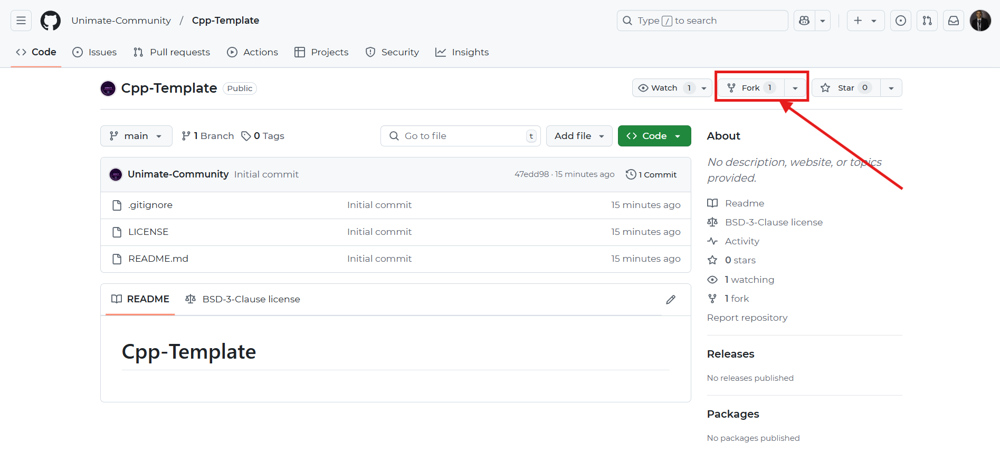
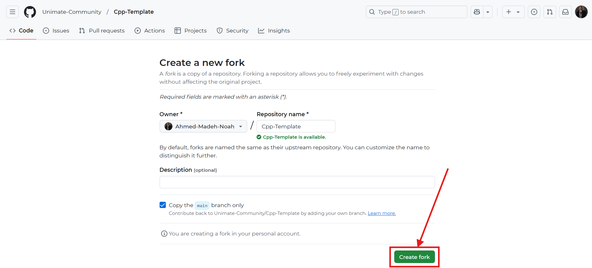
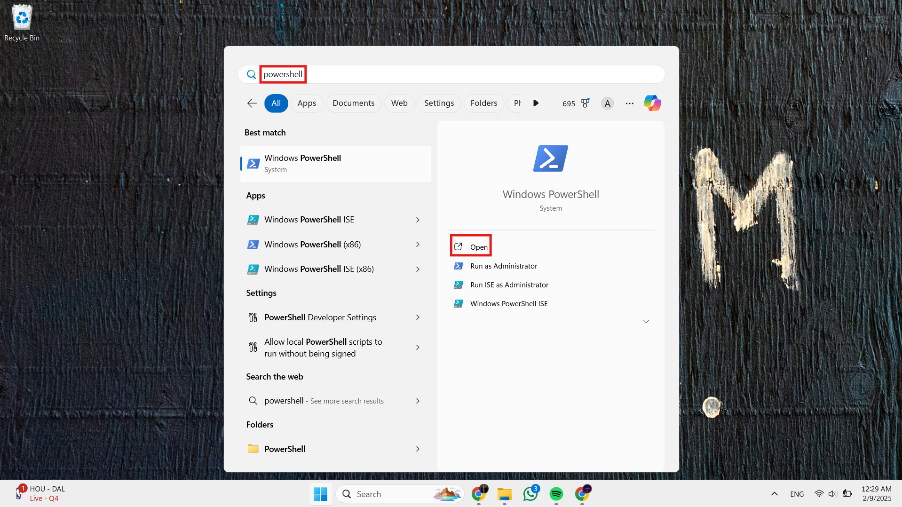
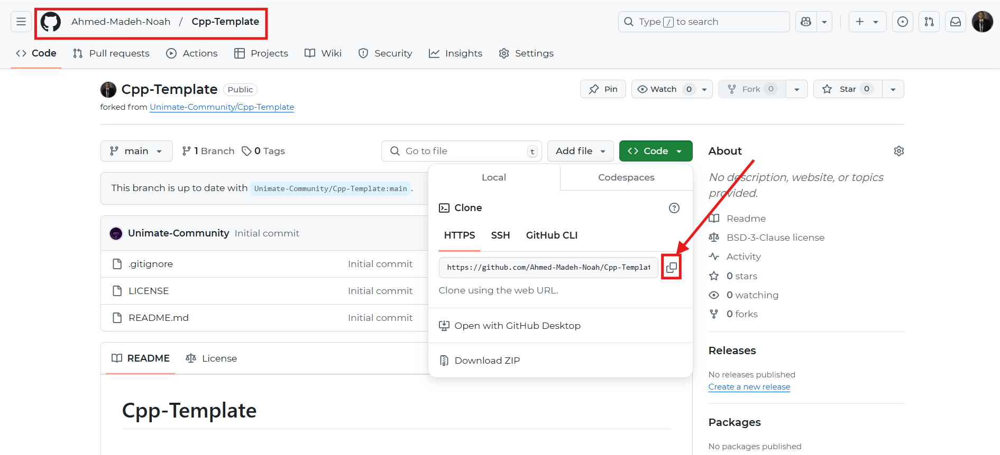
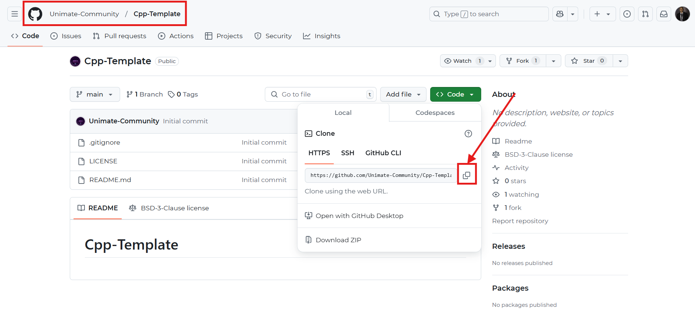
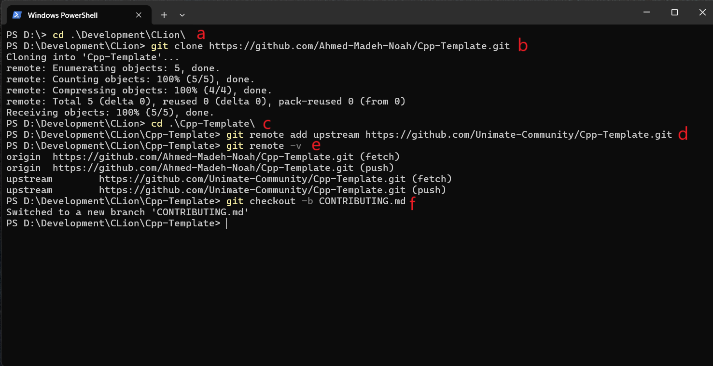

# Contributing Guidelines

Thank you for your interest in contributing to this project! Please follow the guidelines below to ensure a smooth
collaboration.

## How to Contribute

1. **Fork the Repository** – Click the "Fork" button at the top of the repository.  
   

2. **Choose your Repository Name** – Better to leave as is, then Click the "Create Fork" button at the bottom of the
   repository.  
   

3. **Install Git (if not present)** – Download the installer from [here](https://gitforwindows.org/) and follow the
   installation process.

4. **Open Powershell (or git bash)** – Search Windows apps for powershell and open it.
   

5. **Get Your Fork Repo URL** – Click the copy button from the photo (in YOUR fork).
   

6. **Get Unimate's Fork Repo URL** – Click the copy button from the photo (in UNIMATE'S repo).
   

7. **Execute the Following Commands** – Do not forget to change them to what is respective for your case!
   
   a. *Choose Where to Put the Repo* – Replace "Development\Clion" with where you want to clone the repo.
   ```sh
    cd .\Development\Clion\
   ```
   b. *Clone Your Fork* – Replace the url with your fork url.
   ```sh
    git clone https://github.com/Ahmed-Madeh-Noah/Cpp-Template.git
   ```
   c. *Navigate to Your Clone* – Replace the "Cpp-Template" with the clone name.
   ```sh
    cd .\Cpp-Template\
   ```
   d. *Add the Original Repo as an Upstream* – Replace the url with Unimate's repo url.
   ```sh
    git remote add upstream https://github.com/Unimate-Community/Cpp-Template.git
   ```
   e. *Ensure Everything is Okay* – Check if the output is similar to this one.
   ```sh
    git remote -v
   ```
   e. *Create Your Branch* – Replace "CONTRIBUTING.md" with the thing you are going to add.
   ```sh
    git checkout -b CONTRIBUTING.md
   ```

8. **Do Your Thing** – Edit your clone and add what you want!

9. **Stage Changes** – Execute the following command.
   ```sh
    git add .
   ```

10. **Commit Changes** – Replace "Add CONTRIBUTING.md" with your commit message.
   ```sh
    git commit -m "Add `CONTRIBUTING.md`"
   ```

11. **Push your Branch** – Execute the following command.
   ```sh
    git push origin CONTRIBUTING.md
   ```

12. **Wait for any Comments or Reviews** – Try to respond quickly!

13. **Create a Pull Request**  – Replace the url with the one git gives you and visit
    [the url](https://github.com/Ahmed-Madeh-Noah/Cpp-Template/pull/new/CONTRIBUTING.md).

14. **Update Your Fork**  – Execute the following commands.
   ```sh
    git checkout main
    git pull upstream main
    git push origin main
   ```

15. ***Keep Contributing***